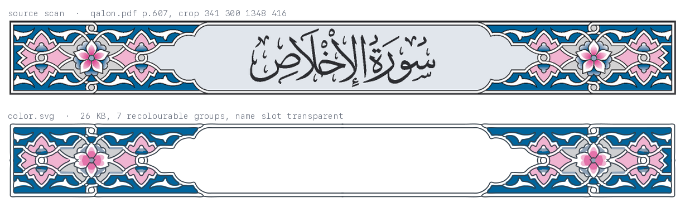
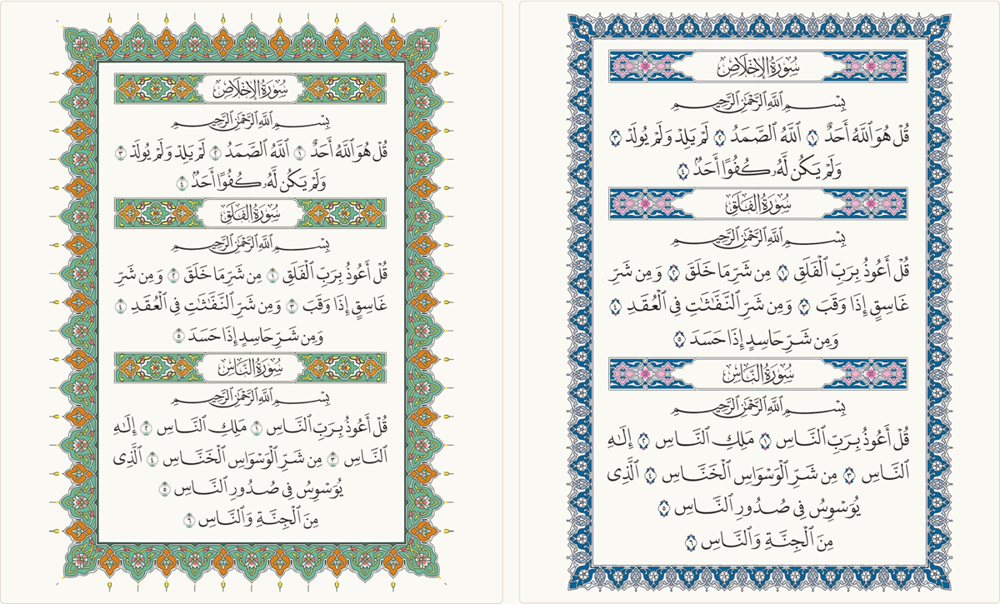

# quran-assets

Surah headers, page frames and ayah markers from eight printed mushafs, traced into
recolourable SVGs — with the scan they came from recorded in every file.



The name is gone, the gradient bands are gone, the paper is gone. What is left is one
group per printed ink, a transparent slot where the calligrapher left room for the surah
name, and this on the root element:

```
data-source-file="qalon.pdf"  data-source-page="607"  data-source-box="341 300 1348 416"
```

---

**زخارف المصاحف، جاهزة للتطبيقات.** عناوين السور، وإطارات الصفحات، وعلامات الآيات،
مستخرَجة من ثمانية مصاحف مطبوعة ومحوَّلة إلى ملفات SVG نظيفة قابلة لإعادة التلوين، لكل
رواية زخرفتها. كل ملف يحمل مصدره: اسم المصحف، ورقم الصفحة، وبصمة sha256 للملف الأصلي.
الأصول **لم تُرخَّص للنشر بعد** — انظر [LICENSE.md](LICENSE.md).

---

## What's here

**79 assets from two lineages, under one contract.**

*Traced from eight printed mushafs* — three types × eight mushafs = 24, a set per riwāyah
rather than one generic set: Qālūn, Warsh, al-Dūrī, al-Sūsī, Shuʿbah, and Hafs in three
printings (ʿĀdī, Madinah mumtāza, Madinah kabīr).

*Taken from the `U+06DD` glyph of 26 Arabic fonts* — 47 more ayah markers, 20 designs across
their weights, each layered into recolourable groups by hand and carrying a hand-placed box for
the ayah number. They also ship as a PUA font. 40 of the 47 are OFL-1.1 verified and are the
only things here currently clear to redistribute.

A style id says which is which: `mushaf-qalon`, `font-003-regular`. One rule, every type.

Each in `assets/<type>/<style>/`: `color.svg` (26 KB for a header, 6 KB for a marker),
`mono.svg`, `meta.json`, and the crop or outline it came from. Scan assets add `line.svg`;
page frames also carry `slices/` — see below.

## On a page



One typeset page, wearing two mushafs' ornaments. Open `demo/index.html` to switch
between all eight, recolour any group, and copy the SVG.

The border is not one fixed shape. Where a border tiles, it ships as three pieces —
corner, horizontal unit, vertical unit — and assembles to whatever page you have:

```js
import { get, frame } from "@quran-ws/assets";        // built by `python -m qa dist`

const svg = await frame(get("page-frames", "mushaf-qalon"), { width: 210, height: 297 });
```

The corner keeps its shape; only the edge runs repeat. Seven of the eight tile;
`mushaf-hafs-madinah-kabir` does not, has no `slices` entry, and ships whole — the build
measures that rather than guessing (below).

## The contract

Every file, every type, same shape. viewBox height is 100, so width is the aspect.

```svg
<svg viewBox="0 0 863.429 100" data-style="mushaf-qalon" data-asset="surah-header"
     data-slot="180.8571 8.5714 501.4286 83.1429">
  <g fill="none"    class="slot" data-part="slot">…</g>   <!-- where the name goes -->
  <g fill="#fff"    class="c1"   data-part="c1">…</g>     <!-- fills, light → dark -->
  <g fill="#cfd0d2" class="c2"   data-part="c2">…</g>
  <g fill="none" stroke="#343f49" class="line" data-part="line">…</g>
</svg>
```

Colours are presentation attributes, never inline `style`, so `.c2{fill:var(--brand)}`
wins and a rasterizer with no CSS at all still renders the file correctly. `data-slot`
is in viewBox units: place the surah name, the ayah number or the page text there.

`catalog.json` says the same thing to a machine, and adds where it came from:

```json
{
  "id": "surah-headers/mushaf-qalon", "lineage": "scan", "aspect": 8.63429,
  "slots": [{ "role": "surah-name", "x": 180.86, "y": 8.57, "w": 501.43, "h": 83.14 }],
  "sources": [{ "kind": "mushaf-scan", "riwaya": "Qalun 'an Nafi'", "pdf_page": 607,
                "sha256": "cbbb52b2…aef8de", "crop_box_px": [341, 300, 1348, 416],
                "archive_url": "https://archive.org/details/quran-qalon" }],
  "license": { "id": "CC-BY-NC-SA-4.0", "status": "provisional", "redistributable": false }
}
```

## Rebuild it

The PDFs are not committed — fetch them and the 24 scan assets regenerate from scratch.

```bash
bash sources/fetch_mushafs.sh     # ~2 GB from archive.org
pip install -r requirements.txt   # + poppler and cairo on PATH

python -m qa build                # render → detect → clean → symmetry → vectorize → slice
python -m qa optimize             # svgo, then rewrite meta.json to match the delivered file
python -m qa validate             # catalog schema, SVG contract, licence traceability
python -m qa quality --baseline tests/quality-baseline.json --out work/quality
```

No manual crop boxes: the headers, frames and markers are found on the page by their own
geometry, and per-job overrides live in `qa/jobs/<type>.json`.

The font-derived markers need none of that — `python -m qa build --lineage font` rebuilds all 47
offline from what is committed, in a second. The expensive half (scraping the families,
deduplicating the outlines, deriving the number boxes with HarfBuzz) ran once; its output, and
the two things that were done by hand — the contour-to-layer assignment and the 47 number
centres — live in `qa/font/data/`.

## How good is it, actually

Not a claim — a gate. `qa quality` renders every asset at 360, 1000 and 4000 px, diffs
the ink against the cleaned scan, and fails on any deterioration against
`tests/quality-baseline.json`. The 4000 px pass is the one that earns its keep: it caught
broken marker outlines that looked perfect at app size.

A font marker is vector in and vector out, so it is compared with the outline it was extracted
from instead of a scan. That check earns its keep: it scored one design family at 0.22 because
the layering had silently dropped a base fill drawn as an `<ellipse>` rather than a `<path>`.
All 47 now score ≥ 0.99.

Frame slices are checked the same way — cut, reassembled, compared with the frame they
came from. Qālūn scores 0.81; the seven that ship range 0.74–0.96; Kabir fails at 0.49
and is therefore not sliced.

`hafs-madinah-kabir` is a 150 dpi source and is the weakest of the eight throughout.
[`docs/QUALITY.md`](docs/QUALITY.md) says what the numbers mean and what they cannot tell
you.

## Licence — read this before using anything

**The scan-derived assets are not cleared for redistribution.** They are tracings of ornaments
printed in mushafs whose designs belong to their publishers. The working position is
CC BY-NC-SA 4.0, status `provisional`, while written permission is sought.

**40 of the 47 font-derived markers are OFL-1.1 and may be redistributed**, with the licence and
each family's copyright notice travelling with them — `qa dist` writes both into
`dist/LICENSES.md` in full, because the OFL requires it. Marker ids are numeric on purpose: the
OFL forbids a Reserved Font Name (Alkalami, SIL, Scheherazade, Plex, Source) naming a modified
version, and nothing here carries a family name. The remaining 7 (designs 014–020, from
`fonts.quran.ws`) have terms nobody has confirmed; they ship flagged `pending`, and it is they
and the scan assets that keep the npm package private.

That position is enforced, not just stated: `qa validate` refuses to let an asset claim
`confirmed` without written evidence in `sources/licenses/`, `qa dist` marks the npm
package `"private": true` while anything is unconfirmed, and the release workflow refuses
to publish it. Every asset carries its own source, so the decision can be made per
mushaf. See [LICENSE.md](LICENSE.md) and [`docs/PLAN.md`](docs/PLAN.md) §6.

## Next

| | |
|---|---|
| Using the assets in an app | [`docs/USAGE.md`](docs/USAGE.md) |
| The two lineages, stage by stage | [`docs/METHOD.md`](docs/METHOD.md) |
| The SVG contract in full | [`docs/CONVENTIONS.md`](docs/CONVENTIONS.md) |
| What is decided and what is open | [`docs/PLAN.md`](docs/PLAN.md), [`docs/HANDOVER.md`](docs/HANDOVER.md) |

A quran.ws project. Alpha: the assets and the pipeline are real, nothing is published.
